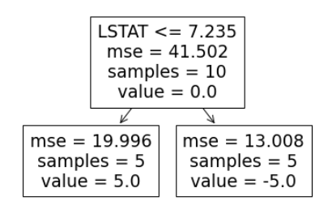
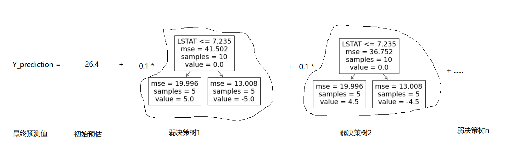

# GradientBoosting
GradientBoosting原理学习并用于解决Kaggle入门题目：Spaceship Titanic,Predict which passengers are transported to an alternate dimension

<b> 梯度提升算法(GradientBoosting)的核心是通过增加弱决策树，对损失函数的梯度进行更新，从而实现最小化损失函数</b>

GradientBoosting算法既可以用于回归问题，也可以用于解决分类问题

回归使用的损失函数是<b>MSE</b>，分类使用的是<b>对数似然</b>。

### 回归问题(Regressor)

既然是用梯度来最小化损失函数，我们有必要先引入损失函数

$$L=\frac1n\sum_{i=0}^n(y_i-\gamma)^2$$

我们需要思考的一点是，这里，$y_i$是目标值（Target  Label，数字），$\gamma$是预测值，在这个函数中，$\gamma$是我们要求解的变量。

第一步，建立基础模型$F_0(x)$，初始化预测值。思考神经网络的梯度更新方法，我们需要初始化变量（在神经网络中，变量是权重，而这里，变量是我们要求解的预测值）。一个简单的方式是设置初始预测值为所有训练样本的目标值的平均值，也就是让测试样本在初始预测中的结果为同一个值。可以看出，第一步其实是一个简单的操作步骤，即设置每一个样本的初始预测值为所有训练样本的平均值，为了放方便后续的公式表达，用了$F_0(x)$表示了输出模型。

第二步，计算残差(residual),即计算每个样本的目标值与基础模型预测值的差值，即

$y_i-\gamma_i$,i=1,2,3,...,n。这里需要先理解差值的含义，根据我们使用的损失函数，

对损失函数L求梯度，为了便于更直观的理解，这里我们先调整一下损失函数，令:

$$L=\frac12*\frac1n\sum_{i=0}^n(y_i-\gamma)^2$$

求解梯度

$$\frac{dL}{d\gamma_i}=-(y_i-\gamma_i)$$

这里可以看出,差值$y_i-\gamma_i$即为损失函数的负梯度。那么根据梯度下降原理，沿着梯度方向，能获得损失函数的最小值

第三步，引入一颗弱决策树$h(x_i)$，这颗决策树的作用是对残差进行预测。为什么是对残差，而不是对target label进行预测呢？因为我们目的是做梯度更新，通过对残差进行归回，将产生新的预测值，进而实现损失函数的降低。

第四步，找出引入的这颗弱决策树每个叶子节点的输出（即新的预测值），如下公式就是我们的目标，即求解每个样本对应的残差，求解对该残差的预估值

$$\gamma_{i}=argmin_{\gamma}\sum_{i=0}^nL(y_i,F_0(x_i)+h(x_i))$$

决策树的回归结果是有限个值，会存在一个叶子的预测值对应多个残差值的情况。

因此，为了使得损失函数L的值最小，那么需要分两种情况。

1. 该决策树的叶子对应一个样本，那么新的预测值=原始残差

2. 该决策树的叶子对应多个样本，那么新的预测值=对应多个样本的平均值

两种情况都可以看作，将所有叶子节点对应的残差值进行平均，作为该叶子节点的输出值。

这里需要指出，该弱决策树$h_m(x_i)$的回归按照决策树的归回算法即可完成划分，得到每个叶子对应的样本。

第五步，我们需要更新前一个模型对目标值的预估，更新公式如下：

$$F_1(x)=F_0(x)+\nu_0h_m(x)$$

这个公式就类似神经网络中的权重更新公式，这里，$\nu$代表学习率。m表示第m颗决策树。

上述过程完成了引入1颗决策树的过程，接下来迭代更新基础模型的输出为前一次操作得到的目标预估$F_m-1(x)$,通过上述5步，得到$F_m,(x)$。

接下来我们用一个很简单的例子来理解：

在这个例子中，我们只有一个特征

|  特征x（LSTAT）  |  目标y（PRICE）  |
| ---- | ---- |
|  4.98	   |    24.0   |
|   9.14	    |    21.6  |
| 4.03 | 34.7 |
| 2.94 | 33.4 |
| 5.33 | 36.2 |
| 5.21 | 28.7 |
| 12.43 | 22.9 |
| 19.15 | 27.1 |
| 29.93 | 16.5 |
| 17.10 | 18.9 |

第1步，初始化基础模型，输出预测值prediction1，即目标y的均值=26.6。

第2步，计算残差residual1，得到结果如下：

| 特征x（LSTAT） | 目标y（PRICE） | prediction1 | residual1 |
| -------------- | -------------- | ----------- | --------- |
| 4.98           | 24.0           | 26.4        | -2.4      |
| 9.14           | 21.6           | 26.4        | -4.8      |
| 4.03           | 34.7           | 26.4        | 8.3       |
| 2.94           | 33.4           | 26.4        | 7.0       |
| 5.33           | 36.2           | 26.4        | 9.8       |
| 5.21           | 28.7           | 26.4        | 2.3       |
| 12.43          | 22.9           | 26.4        | -3.5      |
| 19.15          | 27.1           | 26.4        | 0.7       |
| 29.93          | 16.5           | 26.4        | -9.9      |
| 17.10          | 18.9           | 26.4        | -7.5      |

第三、四步，引入一颗弱决策树，对特征x和目标值residual1进行归回训练，为了演示方便，设置max_depth=1,即得到一颗最简单的二叉树。结果如下：

也就是说，我们对第一颗决策树得到的回归结果是将样本分为了两类，每一类都是5个样本，一类的预测值是-5.0，另一类的预测值是5.0.这个时候得到如下的图示结果：

| 特征x（LSTAT） | 目标y（PRICE） | prediction0 | residual1 | residual_prediction1 |
| -------------- | -------------- | ----------- | --------- | -------------------- |
| 4.98           | 24.0           | 26.4        | -2.4      | 5.0                  |
| 9.14           | 21.6           | 26.4        | -4.8      | -5.0                 |
| 4.03           | 34.7           | 26.4        | 8.3       | 5.0                  |
| 2.94           | 33.4           | 26.4        | 7.0       | 5.0                  |
| 5.33           | 36.2           | 26.4        | 9.8       | 5.0                  |
| 5.21           | 28.7           | 26.4        | 2.3       | 5.0                  |
| 12.43          | 22.9           | 26.4        | -3.5      | -5.0                 |
| 19.15          | 27.1           | 26.4        | 0.7       | -5.0                 |
| 29.93          | 16.5           | 26.4        | -9.9      | -5.0                 |
| 17.10          | 18.9           | 26.4        | -7.5      | -5.0                 |

第五步，更新对模型的预测，假设学习率$\nu=0.1$，那么，根据更新公式，新的预测值

prediction1=prediction0+0.1*residual_prediction1。这样，我们就完成了一次迭代，接下来，将prediction1设置为基础模型的输出，开始新的迭代，直到完成设定的迭代次数。我们就得到结果。

需要指出，最终的结果形如：

分类问题(Classifier)

Gradient Boosting Classifier用于解决0-1的二分类问题，这时损失函数使用对数损失函数。

$$L=-\sum_{i=1}^n(y_ilog(p_i)+(1-y_i)log(1-p_i))$$

其中$y_i$为标签值$p_i$为结果为1的概率，需要注意一下，由于{y_i}取值为0，1。那么求和的两项$y_ilog(p_i)$和$(1-y_i)log(1-p_i))$同时必然有一项为0

另外，该损失函数的概率$p_i$本质上是，决策树输出的值f(x)，需要经过一个函数$p_i=h(x_i)$转换为0-1之间的概率值。

这里使用的是sigmoid函数，即

$$p_i=\frac1{1+e^{f(x)_i}}$$

所以，最终损失函数的表达公式为：

$$L(y,f(x))$$

采用链式求导法则，损失函数L对f(x)求偏导数：

$$\frac{\delta{L}}{\delta{f(x_i)}}=\frac{\delta{L}}{\delta{p_i}}\frac{\delta{p_i}}{\delta{x_i}}$$

其中，

$$\frac{\delta{L}}{\delta{p_i}}=-\frac{y_i}{p_i}+\frac{1-y_i}{1-p_i}$$

$$\frac{\delta{p_i}}{\delta{x_i}}=p_i*(1-p_i)$$

最终，我们得到，

$$\frac{\delta{L}}{\delta{f(x_i)}}\frac{\delta{p_i}}{\delta{x_i}}=(-\frac{y_i}{p_i}+\frac{1-y_i}{1-p_i})p_i*(1-p_i)=p_i-y_i$$

那么，这里，我们有必要进一步假设第n颗弱回归树的模型为$x_{n,i}=\gamma_(x)$,得到第n次迭代（也就是引入第n颗弱决策树时），第i个样本的损失函数的负梯度表示为：

​		

可以看出，同归回问题一样，我们需要拟合的残差仍然为$p_i-y_i$

